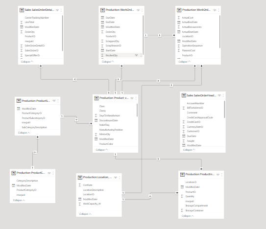
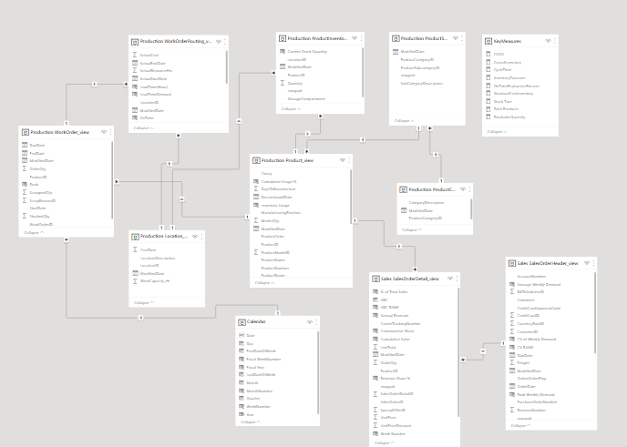
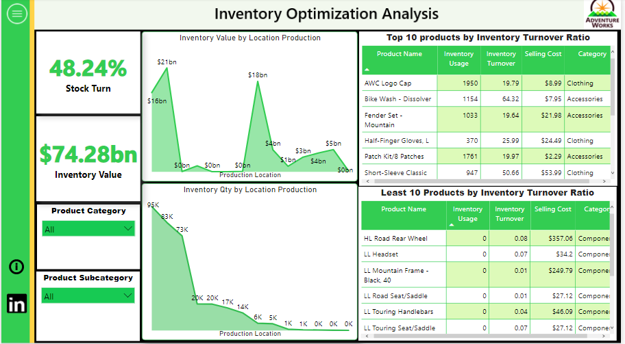

# Januaryclass

This is an analysis of a supersttore bl abl abla

## INTRODUCTION
This is a project done to anaysise number od tsotreThis is an Analysis to optimise inventory management for FitCapacity company by analyzing sales and inventory data using SQL and PowerBI. (The Warehouse picture below is gotten from google)

CLEAN DATASET

DIRTY DATASET

## PROBLEM STATEMENT

The goal of the analysis is to:

- identify which products have the highest turnover rate and which have the lowest turnover rate.
* identify the average time a product is out of stock and the frequency of stockouts.
+ classify products into high-selling, low-selling and average-selling.

## DATA SOURCE
The data used for this work is obtained from the

## SKILLS AND CONCEPTS DEMONSTRATED
- SQL (Select, alias, Views)
- PowerBI concepts like:
- creating columns for calculations for dates, time, and duration

## DATA MODEELING

DIRTY DATASET            |       CLEAN DATSET  
:-----------------------:| :----------------------:
       |  
